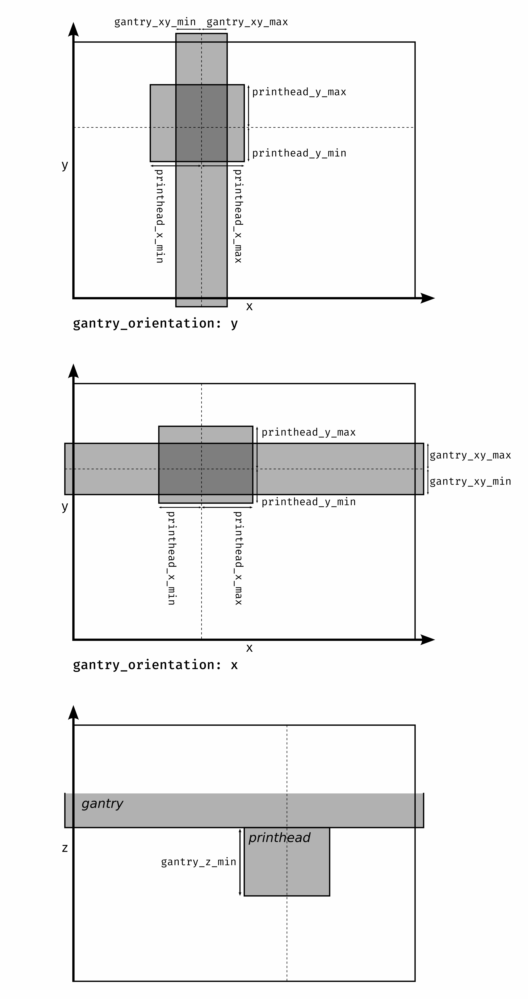

# Collision

Klipper module to check whether another print job can be printed right away
without causing collisions. In case this isn't possible, this module also
provides a function to find an offset that allows a print job to be printed
anyway at a different place on the print bed.

## Configuration

For this module to work some measurements will need to be configured in the
Klipper configuration file under the `collision` section, describing the size of
the printhead and gantry.

```
printhead_x_min
printhead_x_max
printhead_y_min
printhead_y_max
gantry_xy_min
gantry_xy_max
gantry_z_min
gantry_orientation
padding
static_objects
```

`gantry_orientation` should be either `x` or `y` and specifies the axis to which
the gantry is parallel to.

`padding` is optional and specifies how much extra space should be left between
two objects until they are considered to not be colliding. If not provided, this
value defaults to 5mm.

`static_objects` is optional and can be used to specify areas in the print bed
that should always be avoided. It can be a sequence of 6-tuples in the format
`(min x, min y, min z, max x, max y, max z)`. For example to get a cube of side
length 5 along the left edge you could write:

```
static_objects = [(0, 50, 0, 5, 55, 5)]
```

All measurements should be positive (with the exception of static objects)
numbers (int or float) in millimeters.

The following diagrams should help in understanding how all the values are
interpreted:



An example configuration for this section can be found in 
[test_config.cfg](test_config.cfg).

## Tests

The unit tests can be run using `./test.py` or for example `./test.py
CollisionTest` or `./test.py GeometryTest.test_cuboid_eq` to run individual
tests.
