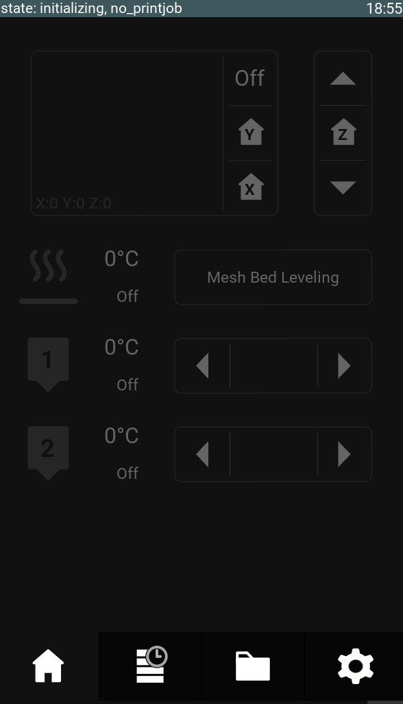

# kgui is the touch UI for klippo
# Compatibility
* Raspberry pi 4
* Most touchscreens compatible with the raspberry pi

# Features
* Filemanager for printing from USB-sticks
* Easily setup Wifi
* Tune parameters while printing
* Accurate and instant print time predictions (with Cura gcode)
* Support for decompressing zip-compressed gcode (Cura .ufp files) on the fly
* Material tracking, keep track of your spools and material use by choosing which material you load with the automatic loading procedure
* A print queue. Add as many print jobs as you like, new jobs will start in paused state
* A print job history, to easily find and reprint past print jobs

